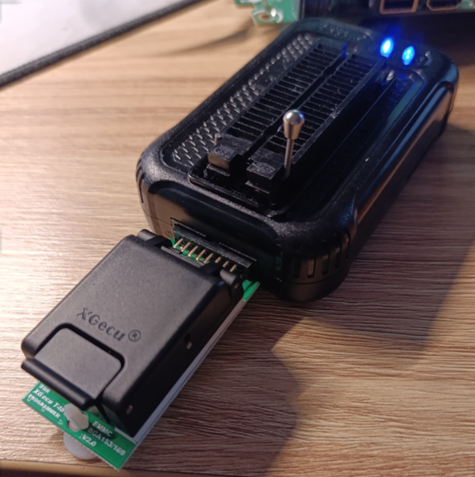

<link  rel="shortcut icon"  type="image/x-icon"  href="icon.ico">
<figure>    </figure>

  
# Introduction

The Hisense [50A6N](https://qrcode.hisense.com/appliance/0000000000200138520000000000000000000?lang=en) is a chinese smart TV which offers 4K resolution. While the TV seems solid and is sold at a cheap price, it failed right after it went out the warranty, a defect in the screen's backlight board. This gave me an oportunity to pry it open and take a look at the insides of the boards.
  

# Internal Photos

The TV has 4 boards, not counting the flexible PCBs that the display uses. 

## Main Board
It's main board houses the power section, the on-board computer (since this is a smart TV, I assumed it used Android).

  
  

The main board's name is `he50a6109fuwts`. Taking a close look at it, we can segment the more interesting parts from the "dumb" components.

The CPU sits behind the black heatsink, and if that doesn't give it away, maybe the backside of the board with all the fine traces leading to it may give it away. To see the CPU the heatsink needs to be desoldered.

| Component  | Name                           | Image                                      | Datasheet                                                                                                |
| ---------- | ------------------------------ | ------------------------------------------ | -------------------------------------------------------------------------------------------------------- |
| CPU        | MStar MSD6886NQGAT-8-00GH      |    | Not available                                                                                            |
| RAM        | Samsung 512MB DDR3L K4B4G1646E |    | [Alldatasheet](https://www.alldatasheet.com/datasheet-pdf/download/1131836/SAMSUNG/K4B4G1646E.html)      |
| EMMC Flash | Toshiba 4GB THGBMDG5D1LBAIL    |  | [Alldatasheet](https://www.alldatasheet.com/datasheet-pdf/download/1179334/TOSHIBA/THGBMDG5D1LBAIT.html) |

The other ICs are not interesting, they are audio amplifiers, inverter ICs, etc.

We will take a closer look at the flash storages after inspecting the other boards.

## Display Board

The second board's name is `CV500U2-T01-CB-1` and is the board that connects to the display. This display board is the second largest board, and is connected with a ribbon cable to the main board, and with other 2 big connectors to the display.

  
  

| Component | Name                                 | Image                                                   | Datasheet                                                                                             |
| --------- | ------------------------------------ | ------------------------------------------------------- | ----------------------------------------------------------------------------------------------------- |
| CPU       | CHOT CCU1221A11N                     |    | Not available                                                                                         |
| SPI Flash | Boya Microelectronics 2MB 25D16ASSIG |  | [Lcsc](https://www.lcsc.com/datasheet/lcsc_datasheet_2304140030_BOYAMICRO-BY25D16ASSIG-T_C382740.pdf) |

## WiFi Board

The third board is named `WTA1`. This board also has an FCCID on the EMI shield. This board is the WiFi/Bluetooth interface of the TV, and the patch antennas are on the side.

If searching on the [fccid.io](https://fccid.io/2AC23-WTA1) website, we can find some useful info about it. It has a microcontroller, MediaTek MT7638GUN controlling the WiFi/Bluetooth interfaces. [shoutwiki](https://techinfodepot.shoutwiki.com/wiki/MediaTek) has a database of these microcontrollers, since the official Mediatek no longer has it on their website.

The FCC external photos also say which antennas are used for WiFi and which is the Bluetooth antenna.

The PCB has interesting markings on the backside and on the topside, which are USB, used as the default communication protocol, and UART, for programming/debugging, I assume.

## IR Board

The last board's name is RSAG7.820.8441 (I think). This last board can be found seated in the case of the TV, and it is used for controlling the infrared remote, since it also has IR receiver. Also, it has the physical button to turn on the computer.

Taking a closer look at the pinout, on the PCB are neatly written the pins' role. The board has an I2C bus, LED signal input and keys/infrared outputs. 

# Flash Analysis

The flash contents of these boards was extracted using a flash reader, an XGecu T48. 

## Display board flash

The first flash chip I analyzed is the flash chip, since it is much smaller, and easier to read, since it's an SOP8, as opposed to the BGA153 package of the main board's EMMC memory. The flash contents for the display board can be found in the GitHub [repo](https://github.com/AndreiVladescu/Hisense-Smart-TV-50A6N-FW-Analysis/blob/main/BY25D16AS%40SOP8-150.BIN.bin).

Most of the memory is empty, and the contents that are not empty are semi-readable, and it looks like a logging memory.

Searching for "demura" on the internet yields some info about the [Demura display calibration technology](https://patents.google.com/patent/CN114495815A/en), which improves the quality of the display - in other words, boring for us. It must contain some factory calibration data.

## Menu board flash

The other memory was harded to acquire, since it's in a BGA153 format. This requires chip-off extraction, with a hot air gun. I didn't bother to reflow it to the PCB again.
If you want to analyze it further, you can try at [this](https://mega.nz/file/V9oEkawL#DQxrA4hBd0lGLq-SNMdKyOvNabxtXYXepjSVROQVD8o) Mega upload link, since it's almost 1.5GB in size.

I unpacked the firmware using `binwalkv3`, since the firmware is big, and original `binwalk` takes a long time. I found lots of partitions, so I decided to use `emba` to automatically analyze it in parallel with me, since it will take some time (it took 20 hours, in retrospect) to analyze the firmware.

### Manual findings

I entered manually every partition on the board, and opened every file of this Linux distribution (didn't find any Android reference), and compiled a [list of interesting files](https://andreivladescu.github.io/Hisense-Smart-TV-50A6N-FW-Analysis/interesting files).

As a shorter list of findings, these were found:

- Private keys
- WiFi SSID & password
- Device ID
- Certificates
- Network configuration files
- Local TV channels database
- Users and their hashed passwords

For the users, I tried brute-forcing them using the [breachcompilation wordlist](https://gist.github.com/vay3t/1b113f765f6acdc442c231b43e74fdb6), but it didn't yield any result.

### Emba findings

The automated emba scan finished after 20 long hours, the logs can be downloaded from [this](https://mega.nz/file/lehgDCJa#BVzlneEs0-DIDvV1rxsMr-0t_Ks-QSSbfFksRK2gogc) Mega link.